# Executive Summary

0xDelta Research has identified and analyzed a new Stealer-as-a-Service (SaaS) platform known as **EvilSoul1337**, operated by threat actors distributing Windows executables disguised as "utilities," "mods," or "indie games." The malware focuses on harvesting browser cookies, sessions, and Discord data, then forwarding it to a Discord Webhook and an interactive real-time C2 panel hosted at:

**evilsoul1337.xyz**

Each customer of the stealer receives:

- A unique lifetime/monthly license ID,
- A personal dashboard,
- A customized stealer binary tied to their HWID.

This report covers the entire kill chain—from the malicious executable to the Webhook traffic, WebSocket communication, panel APIs, and C2 logic.

## 1. Initial Infection Vector

The case began with a suspicious executable posing as a legitimate tool. Dynamic analysis showed behavior consistent with low-tier credential stealers:

- Scanning Chrome/Edge/Brave/Opera profiles
- Reading Cookies, Login Data, Local State
- Preparing exfiltration payloads
- Enumerating installed browsers

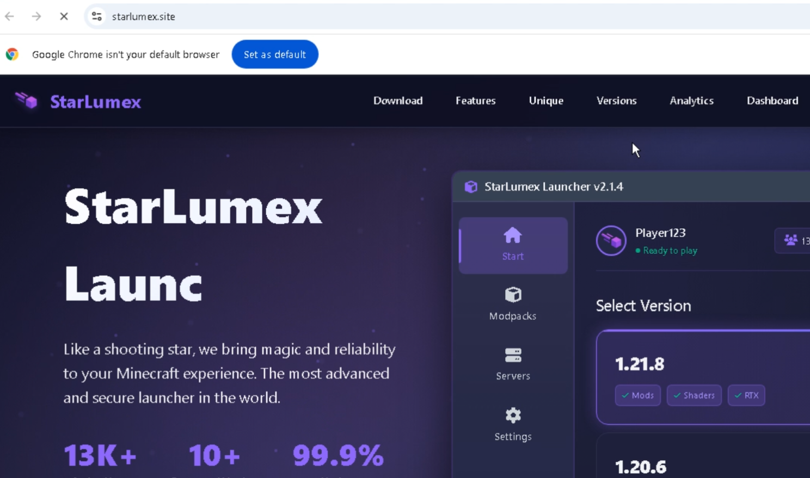
*(Fig 1. One of many sites that distribute malware by masquerading as legitimate software)*

At runtime, the sample generates a unique HWID used to associate victims to a specific threat actor's dashboard.

### 1.1. Initial Analysis – Entropy and Binary Structure

The initial vector, identified as `LauncherOrigenSouls-2.1.0.exe`, is a Self-Extracting Archive (SFX) containing a bundled Electron application. Upon execution, the binary extracts the payload to a temporary directory and launches the Node.js runtime.

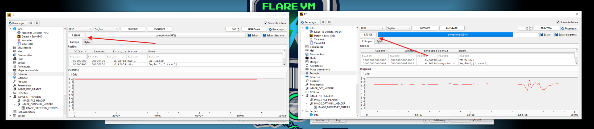
*(Fig 2. Entropy Value is pretty high (this clearly indicates obfuscation))*

### 1.2 Entropy Assessment

The first step of the analysis focused on measuring the entropy of the original binary.

- **Average entropy:** ~7.99
- **Interpretation:** highly compressed or encrypted content

Such entropy levels are typical of:

- Packers
- Loaders
- Self-extracting (SFX) wrappers

The `.text` section exhibited near-maximum entropy, strongly indicating that the executable did not contain the real application logic in plain form.

### 1.3 Section Layout (Compressed Binary)

The original executable exposed a minimal PE structure:

- `.text`
- `.rdata`
- `.data`
- `.ndata`
- `.rsrc`
- Large overlay

The presence of a sizeable overlay and a dedicated `.ndata` section strongly suggested that the executable functioned as a loader or dropper, with the real payload appended to the file.

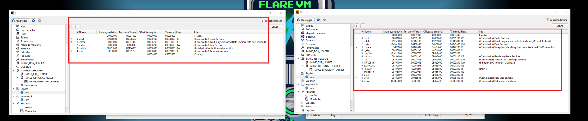
*(Fig 3. Left panel show the obfuscated binary and the right panel show the "real" size of the binary.)*

### 1.4. Payload Extraction

Using standard extraction techniques, the embedded content was recovered, revealing the following directory structure:

```
$PLUGINSDIR/
└── app-64/
    └── resources/
        ├── app.asar
        ├── app.asar.unpacked/
        ├── app-update.yml
        └── elevate.exe
```

This layout is characteristic of Electron applications, immediately shifting the focus of the investigation away from native PE reverse engineering and toward JavaScript and Node.js analysis.

### 1.5. Electron as a Malware Platform

### 1.6 app.asar Analysis

The `app.asar` archive contains the core JavaScript logic of the Electron application. Once extracted, it revealed an extensive Node.js dependency tree incompatible with the claimed purpose of a simple game launcher.

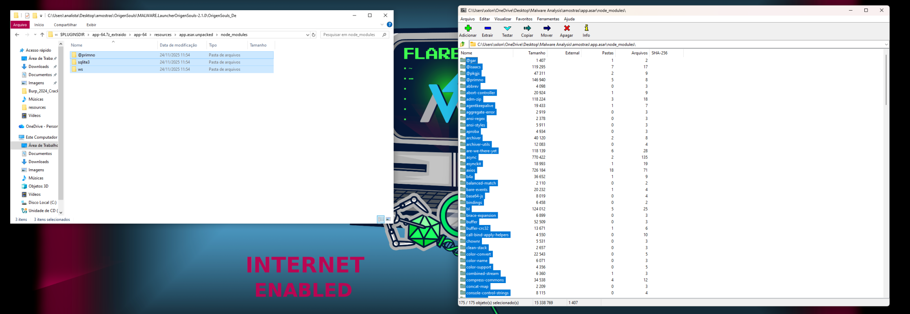

### 1.7 Dependency Review

Inspection of `package.json` exposed several high-risk dependencies:

- `@primno/dpapi`
- `sqlite3`
- `axios`
- `archiver`
- `adm-zip`
- `ws`

The combination of DPAPI access, SQLite database handling, and network exfiltration libraries definitively rules out legitimate usage.

## 2. JavaScript Bundle Analysis

### 2.1 Obfuscation Techniques

The main script (`dist/bundle.js`) was heavily obfuscated using:

- Rotating string tables
- Dynamic `Function()` constructors (eval-like behavior)
- Getter-based indirection to hide global objects (`process`, `Buffer`, `vm`, etc.)

This pattern closely matches aggressive configurations of popular JavaScript obfuscation frameworks.

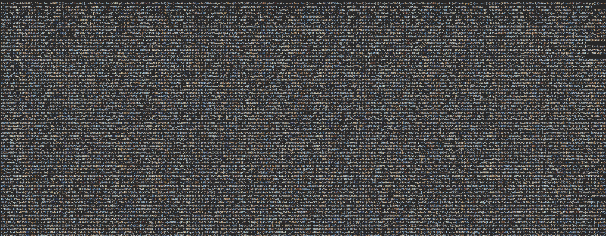
*(Fig 4. Obfuscated Javascript Code)*

### 2.2 Deobfuscation Strategy

Rather than performing full source reconstruction, the analysis focused on:

- Semantic normalization
- Control flow reconstruction
- Behavioral understanding

The objective was to identify capabilities and intent, not to restore a fully executable artifact.

## 3. Malware Functional Flow

### 3.1 Data Collection – Chromium-Based Browsers

The malware implements the following workflow:

1. Locate Chromium profile directories
2. Copy browser databases:
3. Open databases using `sqlite3`
4. Extract `encrypted_value` fields
5. Decrypt values using Windows DPAPI

Affected browsers include:

- Google Chrome
- Microsoft Edge
- Brave
- Generic Chromium derivatives

### 3.2 Token Harvesting – Discord and Electron Apps

- Enumeration of Electron application directories
- Direct access to LevelDB and Local Storage
- Token extraction via regular expressions

No code injection or API hooking was observed; the malware relies exclusively on filesystem access.

## 4. Data Staging and Packaging

Collected artifacts are staged locally and compressed into a single ZIP archive prior to exfiltration.

**Reconstructed Archive Structure:**

```
/logs/
    chrome_passwords.txt
    chrome_cookies.txt
    discord_tokens.txt

/system/
    info.json
    env.json
```

The `info.json` file contains victim fingerprinting data such as:

- Hostname
- Username
- Operating system
- Locale and timezone
- Timestamp

## 5. Exfiltration Mechanisms

### 5.1 Primary Channel – HTTP

- **Method:** POST
- **Encoding:** multipart/form-data
- **Library:** axios

The endpoint is dynamically constructed:

```
https://discord.com/api/webhooks/<...>/<token>
```

## 6. Persistence

No automatic persistence mechanism was identified within `bundle.js`.

The auxiliary binary `elevate.exe` is likely intended for on-demand privilege escalation or auxiliary execution.

## 7. Infection Lifecycle

1. **Initialization:** The malware executes and generates a Hardware ID (HWID) via WMIC or system APIs.
2. **C2 Registration:** It attempts to register the victim by sending a GET request to the C2 server.
3. **Data Collection:** Using internal modules (likely mapped to functions like `GetCookies` and `ProcessBrowser`), it targets Chromium-based browsers (Chrome, Edge, Brave, Opera) to extract cookies, passwords, and local state files.
4. **Persistence:** A shortcut `LauncherOrigenSouls.lnk` is created in the Windows Startup folder.

## 8. Behavioral Analysis: Exfiltration via Discord Webhook

Immediately after execution, the stealer sends its first results to a Discord Webhook:

```
https://discord.com/api/webhooks/1441206370111328359/<token>
```

Example payloads observed:

```json
{
  "username": "EVIL-LIFETIME-97894F3064C9",
  "avatar_url": "https://i.pinimg.com/...jpg",
  "content": "[LOG] [SUCCESS] GetCookies - Extracted cookies from 1 browser(s)"
}
```
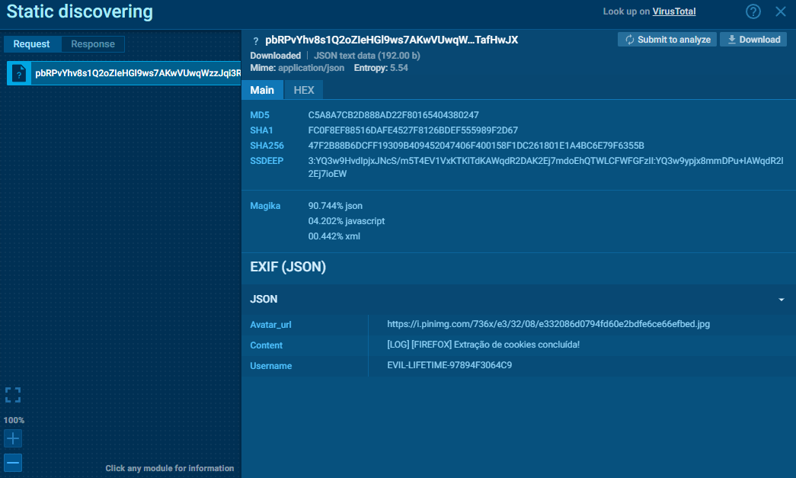

and:

```json
{
  "username": "EVIL-MONTHLY-12F2DE594A84",
  "content": "[LOG] [INFO] Chrome detected. Starting extraction..."
}
```

**Analysis Note:** The username field indicates the subscription tier of the attacker ("LIFETIME" vs. "MONTHLY")

## 9. Registration in the C2 Panel

Once the first data is exfiltrated, the victim device registers itself in the backend using:

```
/victims/found?hwid=<HWID>
```
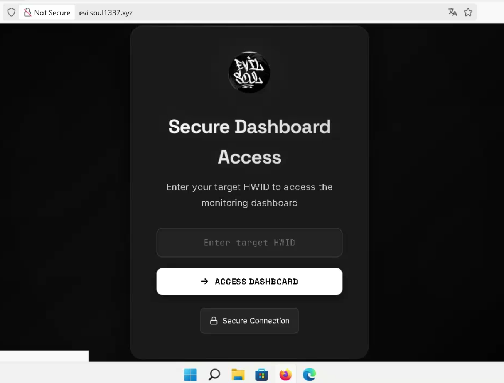
*(Fig 6. EvilSoul Panel Access)*

If the HWID matches an active client's license, the backend responds with `200 OK` and redirects the operator to:

```
/victims/<HWID>/dashboard
```

This page serves as the attacker's control interface, showing system data, extracted cookies, session information, and real-time events.

## 10. Socket.IO Handshake (Real-Time Channel)

When the dashboard loads, the browser immediately initiates a Socket.IO / Engine.IO v4 handshake.

**Initial Polling Request:**

```
GET /socket.io/?EIO=4&transport=polling&t=<nonce>
```

**Server Response:**

```json
40{
  "sid": "SznKlb21KnGJ_jE3AELp",
  "upgrades": ["websocket"],
  "pingInterval": 25000,
  "pingTimeout": 60000
}
```

After this, the connection attempts to upgrade to WebSocket:

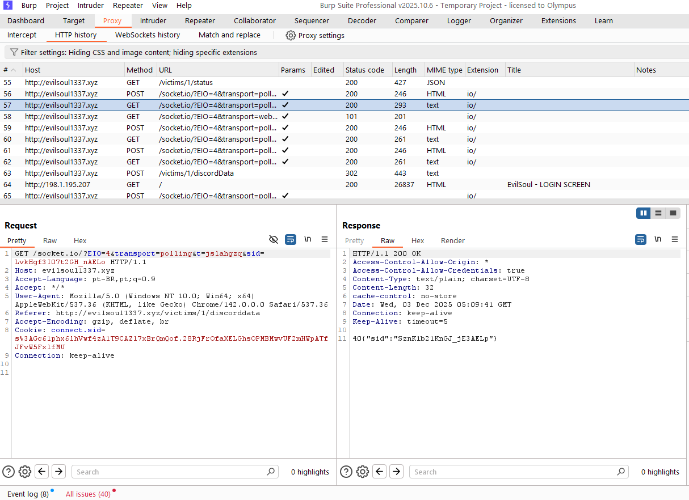

```
GET /socket.io/?EIO=4&transport=websocket&sid=<sid>
```

This channel is used for:

- Real-time victim logs
- Online/offline status
- Browser extraction progress
- Data push from victim → operator
- Operator commands → victim (in advanced builds)

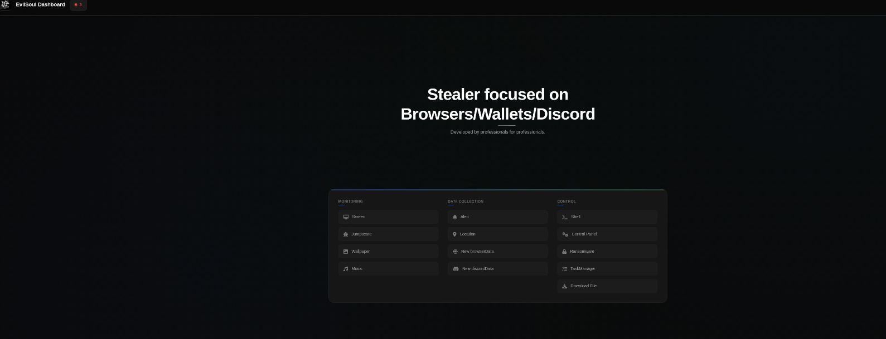
*(Fig 8. Operator dashboard view after login)*

## 11. REST API Endpoints

In parallel to WebSockets, the dashboard continuously polls a REST API:

**Example:**

```
GET /victims/12F2DE594A84/status
```

**Response:**

```json
{"hwid":"12F2DE594A84","online":false}
```

This keeps the dashboard synchronized with the Socket.IO state machine.

## 12. Reverse Engineering the Socket.IO Bundle

The attacker ships a customized `socket.io.js` inside the panel, which we extracted and analyzed. It exposes:

- Event decoder/encoder
- Reserved events (`connect`, `disconnect`, `error`, etc.)
- The full Engine.IO packet parser (40, 41, 42 events)
- Backoff/reconnection logic
- Identifiers for binary events
- The event dispatcher used by the dashboard

**Key functional events observed in the wild:**

- `log`
- `status`
- `getCookies`
- `processBrowser`
- `discordData`
- `browserInfo`
- `cookiesExtracted`
- `victimUpdate`
- `hwid`

**Typical WebSocket packet:**

```
42["log","Chrome detected"]
```

**Exfiltration packet:**

```
42["getCookies", {"total":22}]
```

**Victim status:**

```
42["status", {"online":true}]
```

These packets follow the standard Socket.IO format:

- `42` → Socket.IO EVENT
- First array element → event name
- Following elements → payload

## 13. Stealer-as-a-Service Architecture

The overall business model is clear:

**Customer buys a subscription → receives custom binary + dashboard**

Attacker identities are visible in the webhook usernames:

- `EVIL-LIFETIME-*`
- `EVIL-MONTHLY-*`

**Victim identification**

Each infected system is uniquely mapped via:

```
HWID → Dashboard URL → Socket.IO Room
```

**Backend details**

- Hosted on standard VPS
- Express.js + Socket.IO
- No authentication beyond a simple session cookie
- No TLS enforcement
- No token validation for WebSocket events

This makes the infrastructure extremely fragile and easily fingerprinted.

## 14. Full Infection Chain Overview

1. Malicious executable delivered as "tool/utility/cheat".
2. Stealer executes, scanning browser storage.
3. First-stage exfiltration to Discord Webhook.
4. Victim registers with attacker's panel (`/victims/found`).
5. Dashboard opens, initiating Socket.IO realtime connection.
6. Browser cookies, Discord tokens, and logs are streamed live to the panel.
7. REST endpoint provides machine status.
8. Attacker monitors and harvests data until system cleanup.

## 15. Threat Actor Activity Observed in ANY.RUN (Last 30 Days)

Our team correlated malware execution traces from the ANY.RUN Threat Intelligence panel to identify recent activity associated with the EvilSoul1337 Stealer-as-a-Service infrastructure.

Over the past 30 days, multiple sandbox submissions from unrelated sources communicated with the same Command-and-Control (C2) server, enabling reconstruction of the threat actor's operational footprint.

### 15.1. Repeated C2 Communications

Across all observed executions, infected samples consistently contacted the following host and IP:

- **Domain:** evilsoul1337.xyz
- **IP Address:** 198.1.195.207
- **Ports:** 80, 3000

The presence of two active ports suggests the operator maintains both a production environment (port 80) and a development/staging environment (port 3000) simultaneously exposed on the internet.

**Key URLs repeatedly contacted:**

- `http://198.1.195.207:3000/send-data`
- `http://198.1.195.207:3000/download/panel`
- `http://198.1.195.207/socket.io/?EIO=4&transport=websocket&sid=<id>`
- `http://evilsoul1337.xyz/victims/<HWID>/status`
- `http://evilsoul1337.xyz/victims/<HWID>/discordData`

These match the same endpoints identified during dynamic analysis of the malicious executable, confirming that the observed sandbox samples belong to the same threat actor ecosystem.

### 15.2. Malware Samples Linked to the Actor

ANY.RUN records list several distinct Windows executables associated with this actor, including:

- `StartLemodtSetup.exe`
- `launcherEvilSoul.exe`
- `HookExDllHookExLoaderEvent.exe`
- `StartLemodtSetup\StartLemodtSetup.exe`

The naming conventions, directory paths, and repeated occurrences across different submissions strongly indicate that the threat actor is actively compiling, testing, and iterating new builds of the stealer on a routine basis.

Multiple samples were detected performing:

- Browser data extraction
- WebSocket communication to `/socket.io`
- HTTP registration calls to `/victims/<HWID>/...`
- Exfiltration to Discord Webhooks

This aligns with all behaviors documented in earlier sections of this report.

### 15.3. Infrastructure Consistency

The IP `198.1.195.207` appears across all recorded events, communicating with sandbox environments located in Brazil and Canada. The lack of infrastructure rotation suggests:

- No use of CDN/proxy layers
- No domain flux or IP hopping
- Single VPS acting as both development and production server

This reinforces the assessment that the platform is operated by a low-to-mid–tier threat actor with minimal operational security maturity.

### 15.4. Execution Timeline & Actor Activity Pattern

ANY.RUN logs reveal telemetry peaks at consistent UTC times across several days, indicating ongoing testing/deployment of new builds. The presence of both:

- `/send-data`
- `/download/panel`

on the staging port (3000) suggests interactive debugging or development activity performed directly on the exposed server.

This indicates:

- The threat actor is actively maintaining the service
- New builds and features are periodically pushed
- Development and production environments are merged or poorly separated

Such behavior is typical of SaaS-style criminal platforms in early or mid development stages.

### 15.5. Cross-Sandbox Correlation

Across more than 50 recorded synchronizations, all samples showed:

- Identical WebSocket handshake patterns
- Identical REST API endpoints
- Identical Discord Webhook behavioral signatures
- Identical HWID-to-dashboard mapping process

This allows confident linkage of all collected samples to the same threat ecosystem.

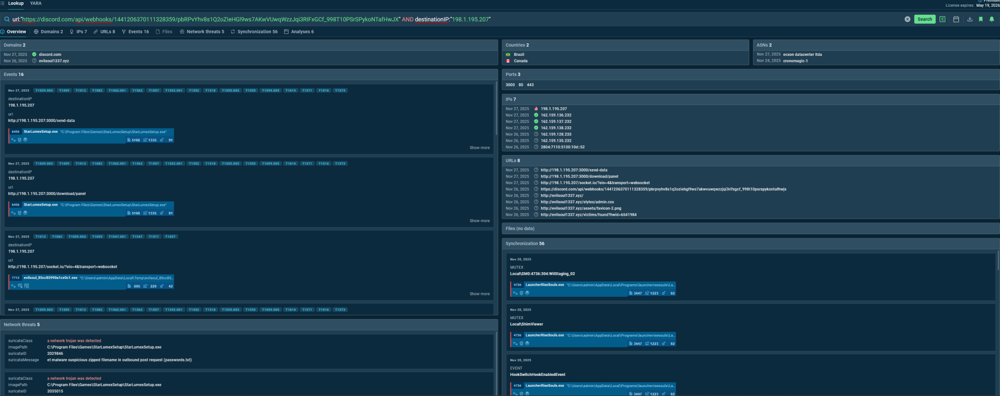
*(Fig 9. Query used at ANY.RUN's Threat Intelligence plataform)*

**Summary of Intelligence Findings**

The ANY.RUN intelligence data confirms that EvilSoul1337 is a centralized, active, and continuously developed Stealer-as-a-Service platform, relying on:

- A single exposed VPS
- A consistent WebSocket-based C2 infrastructure
- Multiple in-development executable builds
- Recurrent use of Discord Webhooks for exfiltration
- Reproducible infection and dashboard registration patterns

This telemetry strongly supports the assessment that the threat actor is maintaining and evolving the stealer, and that new variants should be expected in the short term.

## 16. IOCs

### Hashes

**LauncherOrigenSouls-2.1.0.zip**  
SHA256: `025a2ea99c744bdd7f50aaf28f1259df094dfaeac1660ab5843fb5f1af71e6de`

**PermaFrost-Setup.rar**  
SHA256: `e98abbb05f207453bb8c722581c35ad82c7d35caa8bd7e16f0fddbca4173ad02`

**StarLumex-Client.exe**  
SHA256: `5a2dc26e70cd41ae67fe6ed4639f4941158371db1c02c7420eeaac5cee59cf18`

### Domain

```
evilsoul1337.xyz  
198.1.195.207
```

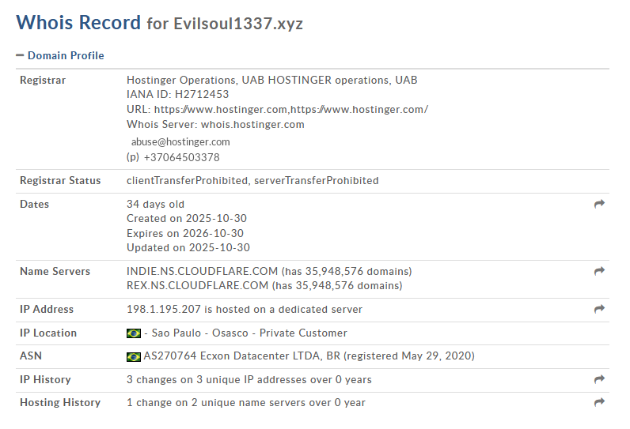

### Endpoints

- `/victims/found`
- `/victims/<HWID>/dashboard`
- `/victims/<HWID>/status`
- `/socket.io/?EIO=4&transport=polling`

### Exfiltration

**Discord Webhook:** `https://discord.com/api/webhooks/1441206370111328359/<token>`

### WebSocket Event Signatures

```
42["log",...]
42["getCookies",...]
42["discordData",...]
42["status",...]
```

These patterns can be detected in network logs due to the recognizable Engine.IO framing.

## 17. Defensive Recommendations

### Network Controls

**Block:**

- `evilsoul1337.xyz` Discord Webhooks (egress)

**Flag Engine.IO signatures:**

### Host-Based Controls

**Alert on unauthorized access to browser files:**

Detect processes accessing Chromium profiles without UI.

### Incident Response

1. Remove malicious executable.
2. Rotate all browser-stored credentials.
3. Invalidate Discord tokens.
4. Purge session cookies.

## 18. Takedown Actions & Post-Incident Status

### 18.1 Actions Taken

Detailed abuse reports were submitted containing:

- Indicators of Compromise
- C2 URLs
- Evidence of service abuse
- Payload samples
- Internal dashboard captures
- References to ToS violations and applicable legislation

**Reports were sent to:**

- CERT-BR
- Hostinger Abuse Desk
- Discord Trust & Safety

### 18.2 Provider Responses

**Discord**

- Webhook token immediately revoked
- Exfiltration endpoint terminated
- Historical logs predictably preserved for investigation

**Hostinger**

Official response received:

> "Listed abusive account(s) has been suspended."

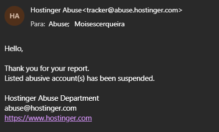

**Technical consequences:**

- Domain stopped resolving (NXDOMAIN)
- The associated VPS dropped instantly
- Port 3000, admin panel, and REST endpoints went dark
- Entire backend stack — including socket.io — became unreachable

### 18.3 Post-Takedown Status

All core components of the EvilSoul1337 operation are now non-functional:

- C2 offline
- Dashboard permanently unreachable
- socket.io sessions without a host
- Webhooks broken
- SaaS deployment compromised
- Threat actor "clients" fully locked out of their dashboards
- Infrastructure removed from the hosting provider

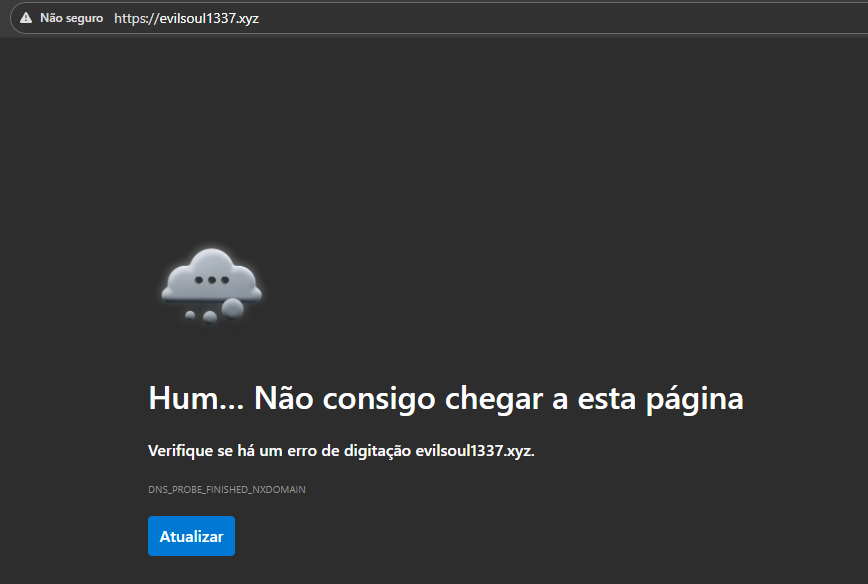

## 19. Conclusion

EvilSoul1337 exemplifies the new wave of low-barrier Stealer-as-a-Service kits:

- cheaply assembled Node.js backend,
- WebSocket-driven dashboard,
- Discord abused as a free exfiltration channel,
- Custom binary builds stitched together without operational maturity

Despite the amateur infrastructure, the platform remained effective: browser cookies and session tokens remains pure gold for those seeking effortless account takeovers.

Ironically, the same weak design that powered the service also became its undoing. The C2 was trivial to fingerprint, monitor, and fully map — a hallmark of entry-level cybercrime ecosystems. These structural flaws enabled a complete investigation, extraction of full telemetry, and the submission of well-founded abuse reports.

As a result, the entire EvilSoul1337 infrastructure was dismantled in under 12 hours after the notifications were sent. The C2 went dark, the dashboards died, the Webhooks collapsed, and the operator's "customers" were left staring to the void.

**The operation has been definitively terminated.**