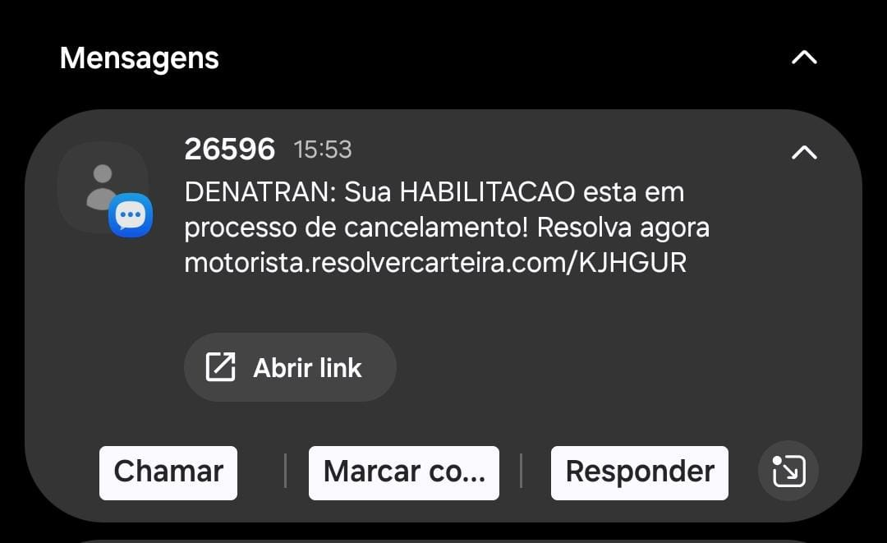
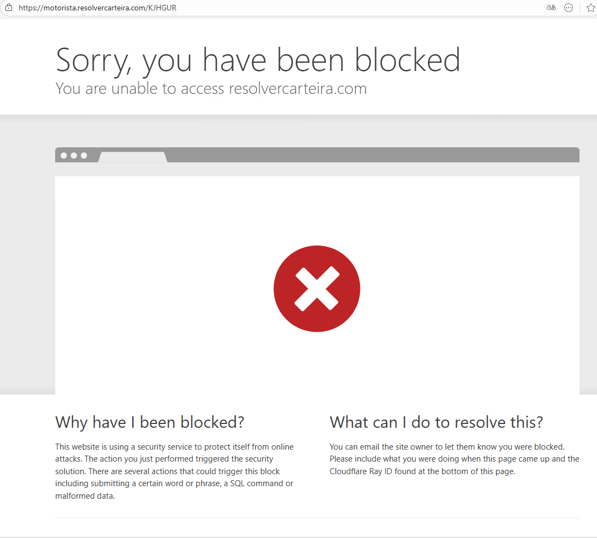
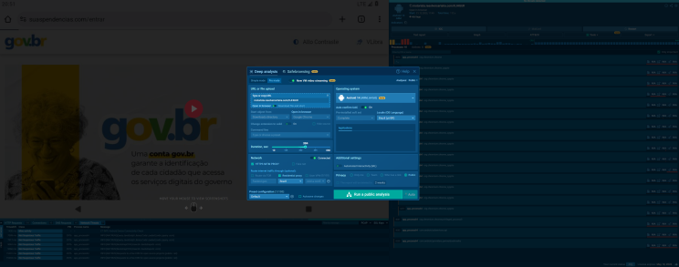
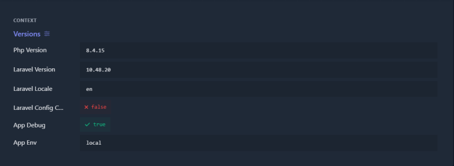
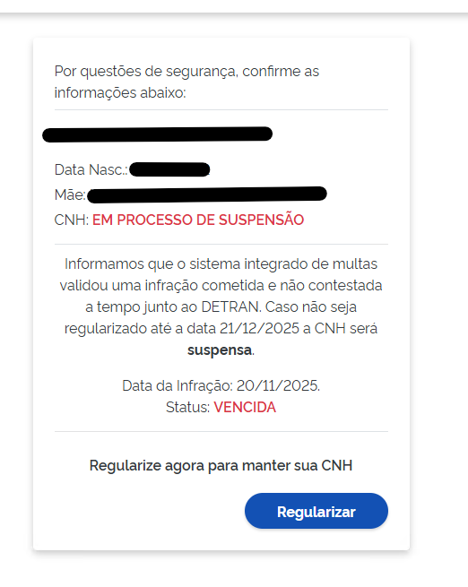
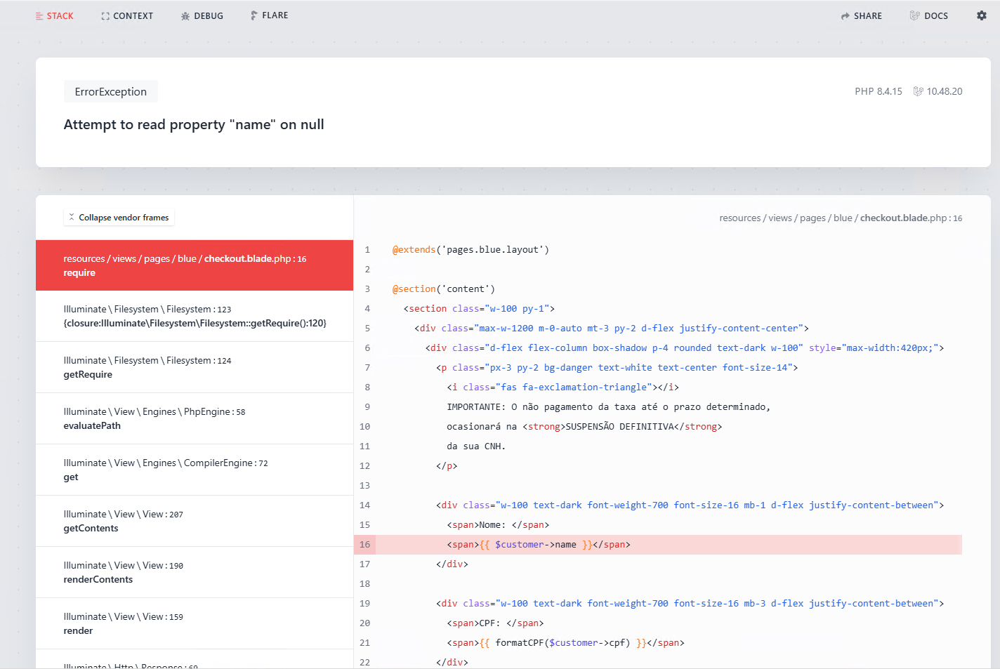
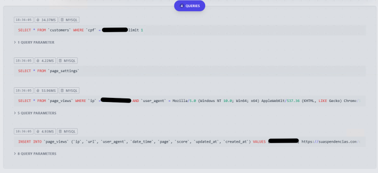

## 1. Executive Summary
*0xDelta* identified and analyzed an active phishing and financial fraud operation impersonating the Brazilian DETRAN authority. The campaign is distributed via SMS (smishing) and leverages mobile-only redirection, backend misconfigurations, and PIX dynamic payments to defraud victims.

The operation is technically unsophisticated but operationally effective, combining:
*   Mobile fingerprinting to evade analysis
*   Exposure of personal data (CPF, full name)
*   A Laravel backend running with debug enabled in production
*   Integration with a third-party PIX payment service provider (PSP)

*The infrastructure is currently live and actively monetizing victims.*

## 2. Initial Attack Vector (Smishing)
### 2.1 Delivery Method
*   SMS messages impersonating official DETRAN notifications
*   Urgent language related to CNH suspension
*   Embedded URL leading to a fake regularization portal



### 2.2 Initial URL
`https://motorista[.]resolvercarteira[.]com/KJHGUR`

*Device-Based Filtering:*
*   *Desktop access:* HTTP 403 Forbidden
*   *Mobile access:* Redirects to phishing workflow

This behavior is consistent with intentional evasion of desktop-based analysis tools and automated scanners.



### 2.3 Device Fingerprinting Bypass via ANY.RUN Mobile Environment
During the investigation, the phishing infrastructure demonstrated explicit device-based access control, blocking desktop browsers with HTTP 403 responses while allowing access exclusively from mobile devices.

To safely analyze the full phishing flow without exposing real devices or relying on physical mobile hardware, a controlled mobile sandbox environment was deployed using *ANY.RUN*.

### 2.4 Sandbox Configuration
The analysis was executed using the following setup:
* [x]   *Platform:* ANY.RUN Interactive Sandbox
* [x]  *Operating System:* Android 14 (ARM, 64-bit)
* [x] *Browser:* Google Chrome (mobile)
* [x]  *Geolocation:* Brazil (pt-BR locale)
* [x]  *Network:* Direct internet access via ANY.RUN infrastructure
* [x]  *Interaction Mode:* Automated Interactivity (ML-assisted)
* [x]  *Analysis Type:* Public deep analysis with video streaming enabled

This configuration intentionally mirrors a legitimate Brazilian mobile user, matching the expected characteristics enforced by the phishing site’s access controls.



### 2.5 Bypass Outcome
Once executed inside the Android environment, the previously blocked URL `https://motorista.resolvercarteira.com/KJHGUR` successfully loaded and immediately redirected to the final phishing domain: `https://suaspendencias.com/entrar`.

This confirms that the infrastructure relies on basic user-agent and device fingerprint validation, rather than advanced behavioral or attestation-based checks.

*The use of a mobile sandbox allowed:*
*   Full visualization of the phishing pages
*   Observation of redirection logic
*   Interaction with form submission and backend responses
*   Extraction of payment flow artifacts (PIX QR code)
*   All without triggering the desktop-based blocking mechanisms.


### 2.6 Analyst Notes
This type of filtering is commonly implemented to:
*   Reduce exposure to security researchers
*   Evade automated scanners
*   Increase victim conversion rates by targeting mobile-first users

However, the controls observed here are trivial to bypass using emulated or sandboxed mobile environments and provide no meaningful protection against analysis. The successful use of ANY.RUN highlights how low-effort device filtering offers no real defensive value against professional investigation.

## 3. Malicious Infrastructure
### 3.1 Domains Identified
*   motorista[.]resolvercarteira[.]com -> Entry point / redirector
*   suaspendencias[.]com -> Main phishing & payment flow
*   qrcode[.]pagsm[.]com[.]br -> PIX payment gateway

### 3.2 Hosting & Protection
*   Fronted by Cloudflare
*   Partial blocking rules applied (ineffective)
*   Origin server leaks internal application data

## 4. Backend Analysis
### 4.1 Technology Stack Disclosure
By forcing invalid application states, the server returned full debug traces, revealing:
*   *Framework:* Laravel 10.48.20
*   *PHP Version:* 8.4.15 (non-stable / development branch)
*   *Environment:* local
*   *APP_DEBUG:* true

This configuration is critical security malpractice, especially for an application handling personal and financial data.



### 4.2 Sensitive Data Exposure
When accessing specific endpoints with a valid CPF, the application returns:

*   Victim full name
*   CPF (Brazilian national ID)
*   Alleged “administrative fee”

*Example observed in production:*
*   *Name:* REDACTED FOR PRIVACY
*   *CPF:* XXX-XXX-XXX-XX
*   *Amount:* R$161.87

*This confirms:*
*   Active storage or ingestion of personal data
*   This constitutes unlawful processing under both GDPR and Brazil’s *LGPD (Lei Geral de Proteção de Dados)*.
*   Potential data scraping or enumeration risk



### 4.3 Application Logic Flaws
*   Static CSRF token reused across sessions
*   Weak input validation
*   Predictable routing patterns
*   SQL queries, internal paths, and controller logic exposed in debug output

These flaws significantly lower the barrier for abuse, replication, or escalation.





## 5. Fraud Flow & Payment Processing
### 5.1 Victim Flow
1.  Victim receives SMS
2.  Opens link on mobile device
3.  Views fake DETRAN warning
4.  Inputs CPF
5.  Sees personalized data
6.  Clicks “Regularize / Generate Payment”
7.  Receives PIX QR Code

### 5.2 PIX Payload Analysis
The QR Code generated corresponds to a *dynamic PIX transaction*.

*Extracted EMV data:*
```
   00 01 Payload Format Indicator
   01 12 Point of Initiation Method (Dynamic)
   26 Merchant Account Information
       GUI: br.gov.bcb.pix
       URL: qrcode.pagsm.com.br/pix/79b4273e-[redacted-for-privacy]
   52 0000 Merchant Category Code
   53 986 Currency (BRL)
   58 BR Country
   59 pagamentoseguro
   60 Piracicaba
   62 Additional Data
   63 CRC
```

*Key Observations:*
*   Not a direct bank account transfer
*   Payment is intermediated by a PSP (Payment Service Provider)
*   Each transaction uses a unique UUID
*   Allows full traceability by the payment provider and Central Bank

## 6. Impact Assessment
*   *Victim Impact*
    *   Direct financial loss
    *   Exposure of national ID (CPF)
    *   Psychological pressure via threat messaging
*   *Systemic Risk*
    *   Abuse of national payment infrastructure (PIX)
    *   Brand impersonation of government entity
    *   Potential money laundering through PSP accounts

## 7. Infrastructure & Attribution Analysis
*Domain Registration (WHOIS)*
The domain suaspendencias.com was recently registered, strongly indicating a short-lived, campaign-oriented phishing infrastructure.
*   *Registrar:* NameSilo, LLC
*   *WHOIS Server:* whois.namesilo.com
*   *Key Dates:*
    *   *Created:* 2025-12-19
    *   *Updated:* 2025-12-20
    *   *Expires:* 2026-12-19

The proximity between creation and update dates suggests rapid deployment, typical of fraud campaigns aiming to operate before detection and takedown.


### 7.1 DNS & Hosting Infrastructure
The domain is fully fronted by Cloudflare, leveraging its CDN and proxy services to obscure the real origin server and delay attribution.
*   *Authoritative Name Servers:*
    *   cash.ns.cloudflare.com (172.64.33.81)
    *   arushi.ns.cloudflare.com (172.64.34.61)

### 7.2 DNS Records Overview
*   *A Records (IPv4):*
    *   104.21.28.33
    *   172.67.170.58
*   *AAAA Records (IPv6):*
    *   2606:4700:3031::6815:1c21
    *   2606:4700:3037::ac43:aa3a
*   *WWW Subdomain:* Fully mirrors root domain, indicating no separation between public and backend infrastructure.
*   *MX Record:* _dc-mx.ce8f7cbd8148.suaspendencias.com
    *   Although MX records are present, there is no evidence that email services are actively used. This is likely a default or placeholder configuration, common in disposable phishing domains.

### 7.3 Hosting & Evasion Characteristics
*   *Cloudflare Proxy Enabled:* Yes
*   *IP Obfuscation:* Active
*   *Geo/Device-Based Filtering:* Observed

This behavior indicates intentional evasion of desktop-based security analysis tools and sandboxes, prioritizing mobile victims reached via SMS (smishing).

### 7.4 Assessment
The infrastructure exhibits multiple indicators of malicious intent:
*   Recently registered domain
*   Cloudflare-fronted disposable hosting
*   SMS-driven traffic acquisition
*   Device-based access control
*   Tight coupling with a fake DETRAN narrative and PIX fraud flow

These elements are consistent with financial phishing operations targeting Brazilian users, abusing trust in government institutions and exploiting urgency-based social engineering.

## 8. Attribution & Confidence
While no direct actor attribution is claimed, the operation shows:
*   Reuse of known phishing infrastructure patterns
*   Commodity Laravel phishing kits
*   PSP abuse consistent with prior Brazilian fraud campaigns

*Confidence level:* High

## 9. Indicators of Compromise (IOCs)
*   *Domains*
```
motorista[.]resolvercarteira[.]com
suaspendencias[.]com
qrcode.pagsm.com[.]br
```    
*   *URL Patterns*
``` 
/consultar
/checkout/{cpf}/gerar
/checkout/status
```     
*   *Technologies*
``` 
Laravel (debug enabled)
Cloudflare
PIX dynamic QR codes
```     

## 10. Conclusion
This campaign represents a *live, monetized phishing operation, not a test or abandoned infrastructure. Its success relies less on technical sophistication and more on institutional impersonation, payment trust, and operational negligence. **Left unchecked, it will continue to victimize users at scale.*

> Full behavioral analysis from ANY.RUN can be found [https://app.any.run/tasks/da379980-71bf-4d11-a395-157f535b85a0].

*Operation conducted by: 0x_olympus*