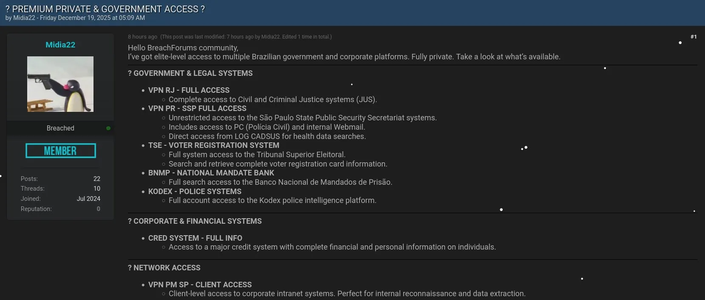
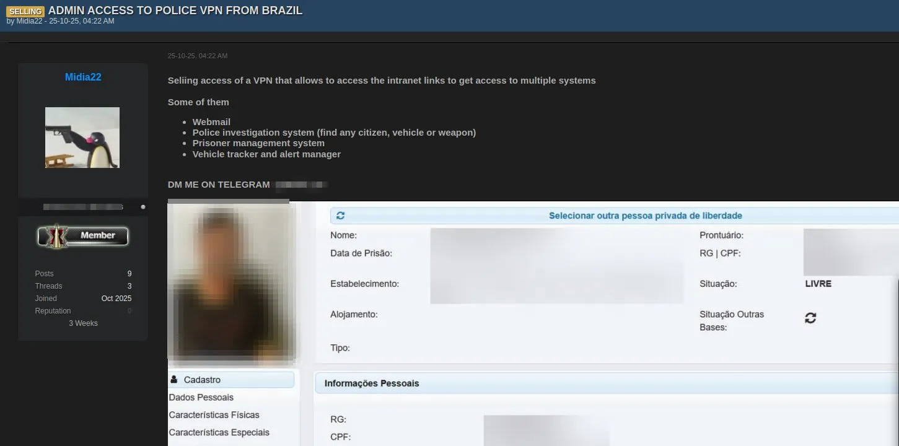
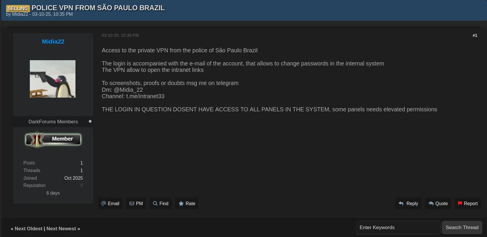
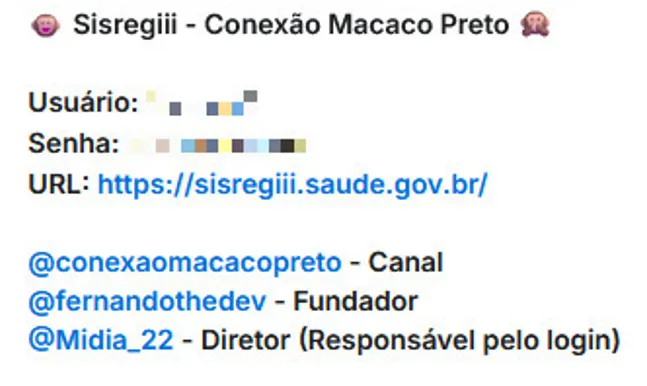
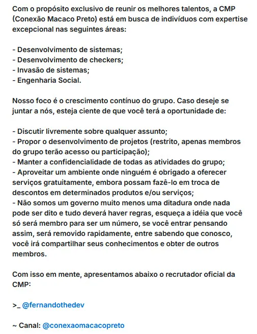
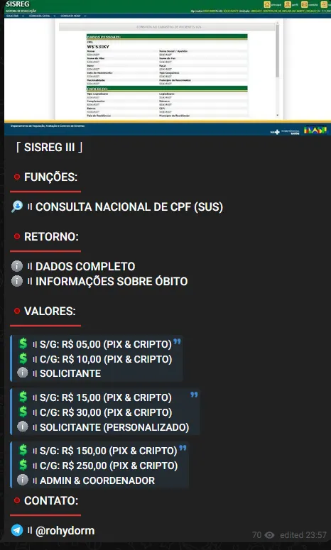
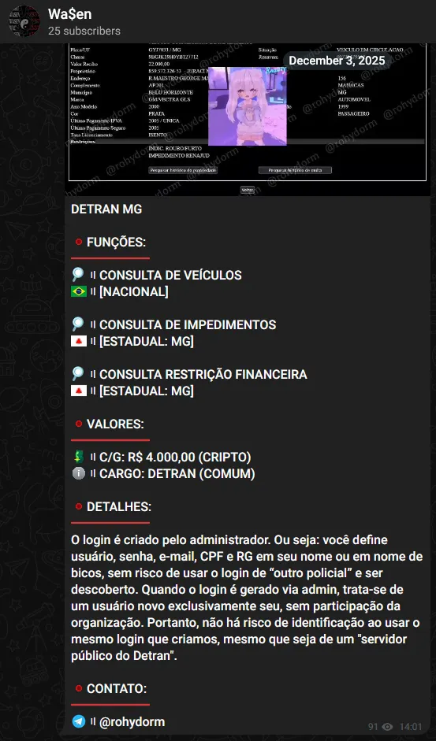

Last year, a brazilian threat actor designated as **Midia22** has emerged as a Initial Access Broker (IAB) and Government Data Trafficker. The intelligence gathered through late 2025 and early 2026 points that Midia22 is currently a operationally relevant actors targeting Brazil’s digital sovereignty. The actor’s specialized commercialization of government databases, federal intranet access logs, and sensitive VPN credentials indicates a model of persistent monetized access.

**Midia22** behavior demonstrates a understanding of the grey zone between cybercrime and fraud enablement. By leveraging encrypted channels such as Telegram for the sale of live access rather than static dumps, the actor mitigates the law enforcement risks. Furthermore, the actor’s ability to procure and sell access to critical utility infrastructure (like gas, traffic, and electricity data) suggests deep supply chain compromises or the successful recruitment of insiders, a vector that has become endemic in the region. This report provides an examination of Midia22 capabilities, ecosystem, and strategic implications of their rise.

## The Brazilian Cyber Threat Landscape
Brazil has historically been distinct in the global cybercrime economy. Unlike Eastern European ecosystems driven by advanced malware development, or North American ecosystems focused on corporate espionage, South America evolved into bank fraud and financial theft. The last months have seen a evolution of this environment, driven by the digitization of public services ([Gov.br](http://gov.br/)) and the ubiquity of instant payments (Pix).

The mass adoption of **Pix**, the Central Bank of Brazil's instant payment system, has altered the incentives for threat actors, the focus shifted to instant bank transfers. This has necessitated a change in the type of data criminals require. **Midia22** inventory becomes a critical enabler for the fraud ecosystem. The FGTS database is a financial ledger of every formal worker in Brazil, containing data points that are often used as knowledge-based authentication (KBA) answers by banks. By selling access to this data, Midia22 acts as a wholesale supplier to the "Pix fraud" industry.

## Insider Threat
The commoditization of insider access creates a fertile supply chain for brokers like Midia22. It is highly probable that the "intranet access" and "VPN logs" marketed by **Midia22** are not the result of exploits, but rather purchased credentials from underpaid IT staff within government contractors or municipalities.

## Midia22
The term "Mídia" (Media) suggests a self conception as a distributor or broadcaster of information. **Midia22** does not appear to have an ideological objective, their activities are purely financially motivated. He fits the behavioral profile of a **Tier 2 Cybercriminal: Specialist Broker**.

**Midia22** differentiates themselves by offering samples rather than just bulk data. The offering of active access to government intranets places them in a higher risk category than mere data resellers, as it implies they maintain a persistent foothold in the target network to verify the access remains live for the buyer.

## Telegram Operations
While investigating **Midia22** digital footprint, a Telegram channel named **Conexão Macaco Preto (CMP)** was discovered, presenting him as “Director”, directly linking our target to an operational leadership position inside **CMP**, specifically tied to authentication and access control.

Such role labeling aligns with an access brokerage model, where one actor specializes in obtaining, validating, or managing access, rather than executing downstream exploitation themselves.

Early messages explicitly describe CMP as a closed group prioritizing confidentiality, internal collaboration, and controlled participation. This framing alone already distinguishes it from opportunistic leak channels, suggesting **intentional organization rather than casual data sharing**.

**Another Telegram group** works likely as a secondary/successor environment, it’s referenced upon entering the CMP original channel.

That leads to a channel called **Wa$en**.

## Direct Attribution
The Telegram user operating under the alias **‘rohydorm’** was selling paid access to SISREG related queries, including national CPF consultation, full personal data retrieval, and mortality information. The offering structure, pricing, and access model position this actor firmly within the **Brazilian access brokerage ecosystem, rather than simple data reselling**.

Their messages emphasizes live consultation capability instead of static data, which materially increases the intelligence value of the offering and aligns with credential or session based access.

The **DETRAN MG** offering claims the ability to provision new user accounts **via administrative level** **access**, granting full control over usernames, passwords, email addresses, and associated identity attributes. **This points to structural system compromise or limited insider facilitation**.

The advertised functionality (vehicle queries, legal impediments, and financial restriction checks) indicates an access model optimized for fraud enablement, target validation, and social engineering support, rather than bulk data exfiltration. The elevated pricing and explicit role classification further suggest a premium access market, consistent with operators acting as trusted access brokers.

The last message sent to the channel says *"May crime come doubled in this 2026. Just wait and see”*.

Based on observed activity, tradecraft, and ecosystem alignment, **‘rohydorm’** represents the same access threat model already associated with **CMP** actors, operating under a different surface identity.
> Different alias.
> Same service.
> Same market.
> Same operation.

## Actor Overview

- **Primary Designation:** Midia22
- **Threat Class:** Initial Access Broker (IAB) / Government Data Trafficker
- **Operational Status:** Active (as of 2026)
- **Geographic Focus:** Brazil (Federal and State-level institutions)
- **Primary Platforms:** Telegram (private and semi-private channels)
- **Motivation:** Financial (Access Monetization)

Midia22 represents a **Brazilian access brokerage operation** rather than a traditional breach-and-leak actor. The cluster operates by acquiring, validating, and reselling **privileged institutional access**, positioning itself upstream in the cyberfraud and cybercrime supply chain.

| **Alias** | **Platform** | **Role** | **Confidence** |
| --- | --- | --- | --- |
| Midia22 | Forums / Telegram | Initial access broker | High |
| Conexão Macaco Preto | Telegram | Operational group | High |
| Wa$en | Telegram | Successor/migration, improved OpSec | High |
| rohydorm | Telegram | Sales operator, direct access commercialization | Medium |

The investigation provides a study case that aliases change and channels migrate, yet the business model remains the same: privileged access is obtained, validated, and monetized with professional discipline. This is access brokerage as an operational service, sustained by insider risk, weak identity governance, and high downstream demand from fraud ecosystems. As long as institutional access can be quietly provisioned and resold, actors like Midia22 will remain replaceable but persistent.
